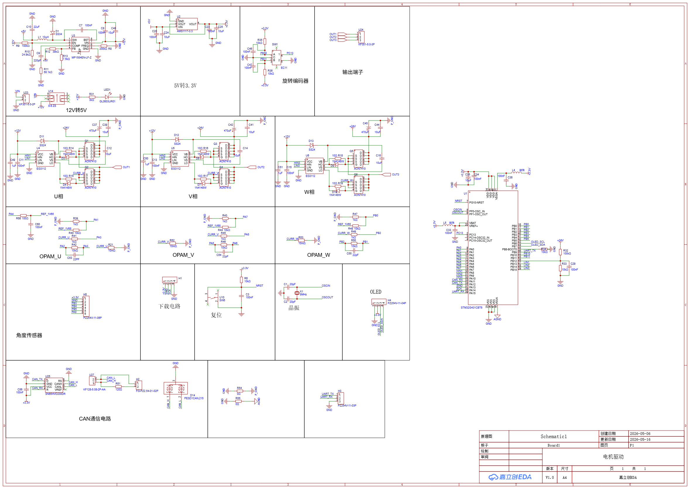
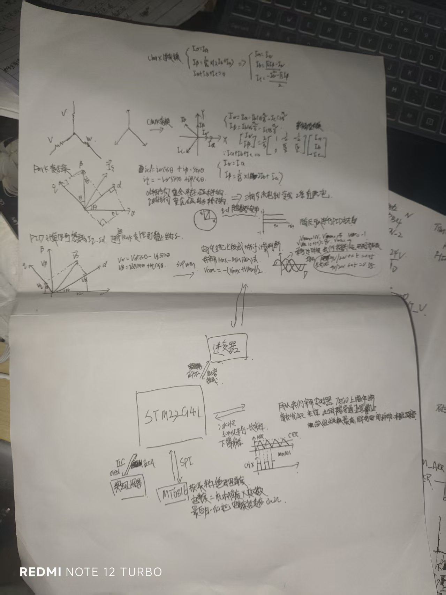
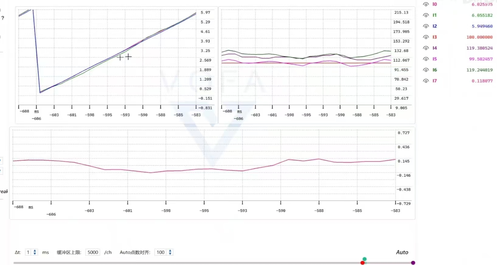

# 个人学习项目：无刷电机 FOC 驱动与 SMO 无感控制初探

## 📖 项目背景

本项目是我在准备电机控制方向实习期间，为了深入理解磁场定向控制（FOC）底层逻辑而开展的个人实践项目。

项目初期，我基于 MCU 平台和 MT6816 磁编码器搭建了基础的有感 FOC 双闭环系统。在打通基础控制链路后，为了进一步挑战并学习工业界常用的无位置传感器控制（Sensorless），我针对表贴式永磁同步电机（SPMSM）尝试引入并验证了滑模观测器（SMO）算法。希望通过这个项目，将书本上的电机学公式转化为实际的 C 语言工程代码。



## 🛠️ 学习与实践内容

在本项目中，我主要完成了以下模块的摸索与编写：

* **底层硬件与采样：** 了解了三相逆变全桥的工作原理；配置了 MCU 的高级定时器、ADC 注入组与内部运放，实现了相电流的低侧双电阻采样与零位偏置校准。
* **基础 FOC 链路：** 采用纯 C 语言手写了 Clark / Park 坐标正逆变换、SVPWM 空间矢量调制以及电流/速度双闭环 PI 控制器。



* **SMO 无感算法摸索：**
    * 根据定子电压方程，构建了基于反电动势的滑模观测器模型。
    * 在查阅资料与实际测试后发现，电机中高速运行时锁相环（QPLL）极易发散。为此在代码中学习并加入了**磁链归一化**处理，以消除转速波动对鉴相误差的放大影响。
    * 针对低通滤波器（LPF）带来的相位延迟，尝试使用反正切（Arctan）函数进行了基础的相位补偿。
* **平滑切换逻辑：** 编写了简单的“开环强拖”逻辑，尝试实现电机从静止起步到产生足够反电动势后，平滑切入 SMO 闭环的过程。

## 🔍 工程验证方法：“影子模式”交叉对比

作为初学者，盲目上机极易炸管或毫无头绪。为了确保数学模型的准确性，我采用了“影子模式（Shadow Mode）”的交叉验证策略：

在代码运行时，以 MT6816 编码器作为实际控制的反馈基准（有感闭环），而在后台静默运行 SMO 算法。借助 VOFA+ 上位机，我将**物理真实电角度**与 **SMO 估算电角度**进行实时波形同框对比。



通过观察两条曲线的相位差与跟随度，我得以直观地反向微调代码中的定子电感 ($L_s$)、磁链以及 PLL 增益。这种“看得见”的调试方法，极大加深了我对观测器参数物理意义的理解。

## 📂 工程目录与学习文档

核心代码与整理的学习资料主要分布在以下目录：

```text
├── doc/                 # 存放开发过程中的原理图、笔记与关键波形对比图
├── FOC/                 # FOC 控制与 SMO 算法的底层实现代码 (纯 C 语言)
└── README.md            # 项目说明文档